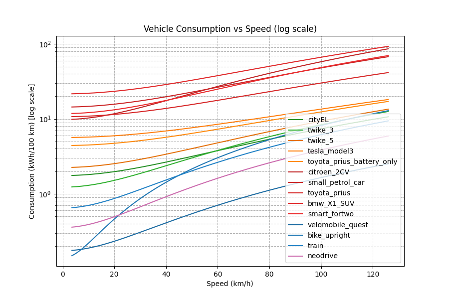

# efficiency-frontier
this repo contains script to explore the limit of efficiency (in the sense of kwh/100km) of wheeled vehicle and compare them to the current existing one.

This graph allow to compare the different mean of transportation between them on the kwh/100km basis.

The script use a simplified model that account for a drag and rolling losses.

Beware that this is a theoretical upper bound with approximate value.

To verify it, one could implement the european standard driving cycle and get one value that is easier to compare across the different type of vehicle but this value alone is usually very optimist in regard to real life performance.

To assess real life performance one could integrate the efficiency over real driving data and incorporate the idling efficiency and the power drawn by auxiliary system like AC or infotainment.

There is more to the story as for instance a bike with a non-drugged adult human will not exceed 50 kmh while a car can spend a significant amount of time above 100 kmh. Other efficiency metric should be taken into account like the road usage while driving or parked, the safety, the noise etc, ...)

